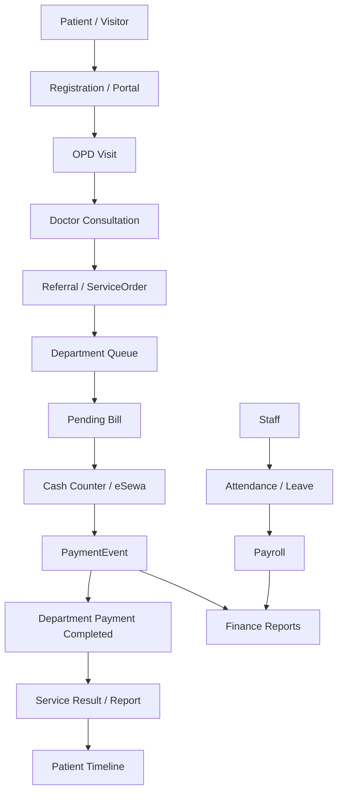

# Data Flow Diagram (Simplified)

```mermaid
flowchart TD
    Patient[Patient / Visitor] --> Registration[Registration / Portal]
    Registration --> Visit[OPD Visit]
    Visit --> Doctor[Doctor Consultation]
    Doctor --> Referral[Referral / ServiceOrder]
    Referral --> Dept[Department Queue]
    Dept --> Bill[Pending Bill]
    Bill --> Cashier[Cash Counter / eSewa]
    Cashier --> Payment[PaymentEvent]
    Payment --> DeptPaid[Department Payment Completed]
    DeptPaid --> Result[Service Result / Report]
    Result --> Timeline[Patient Timeline]
    Payment --> Finance[Finance Reports]
    Staff[Staff] --> Attendance[Attendance / Leave]
    Attendance --> Payroll[Payroll]
    Payroll --> Finance
```
