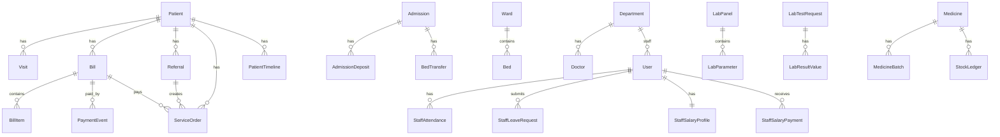

# ER Diagram (Simplified Mermaid)

```mermaid
erDiagram
    User ||--o{ StaffAttendance : has
    User ||--o{ StaffLeaveRequest : submits
    User ||--|| StaffSalaryProfile : has
    User ||--o{ StaffSalaryPayment : receives
    Patient ||--o{ Visit : has
    Patient ||--o{ Bill : has
    Patient ||--o{ Referral : has
    Patient ||--o{ ServiceOrder : has
    Patient ||--o{ PatientTimeline : has
    Referral ||--o{ ServiceOrder : creates
    Bill ||--o{ BillItem : contains
    Bill ||--o{ PaymentEvent : paid_by
    Bill ||--o{ ServiceOrder : pays
    Department ||--o{ Doctor : has
    Department ||--o{ User : staff
    Admission ||--o{ AdmissionDeposit : has
    Admission ||--o{ BedTransfer : has
    Ward ||--o{ Bed : contains
    LabPanel ||--o{ LabParameter : contains
    LabTestRequest ||--o{ LabResultValue : has
    Medicine ||--o{ MedicineBatch : has
    Medicine ||--o{ StockLedger : has
```
